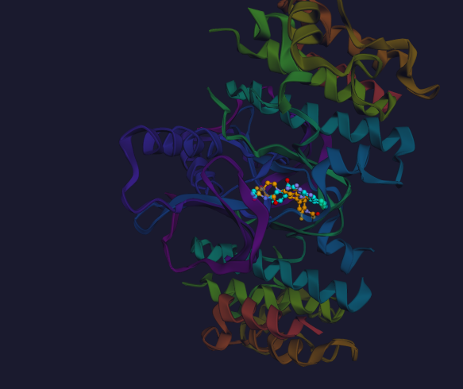
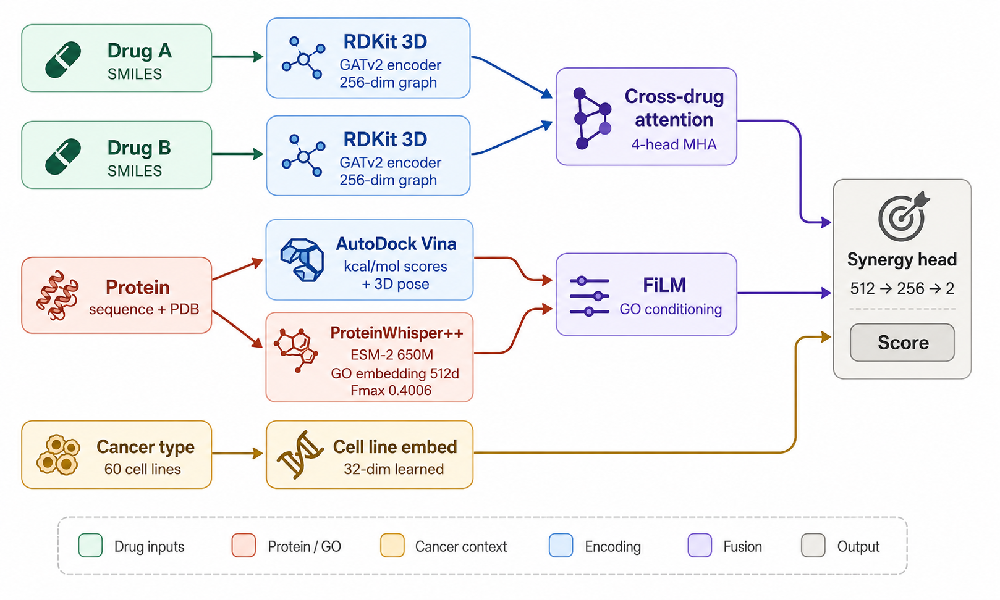

# ProteinSynergyDock

> Predict whether two cancer drugs will work better together — using real molecular docking, protein function annotation, and cancer cell line context.

**Live demo →** [proteinsydock.streamlit.app](https://aprameya05-proteinsynergydock-app.streamlit.app)

---

*Vemurafenib (cyan) and Trametinib (orange) docked inside BRAF kinase (PDB: 3OG7). FDA-approved combination for BRAF V600E melanoma.*

---

## The problem

Most drug synergy prediction tools take two SMILES strings and output a score based purely on chemistry. They never ask: *where does the drug sit inside the protein?* or *what does the protein actually do?* or *does this combination behave differently in breast cancer vs leukemia?*

ProteinSynergyDock combines all three — 3D docking geometry, protein biological function, and cancer cell line identity — into a single prediction pipeline.

---

## How it works

**You give it:** Drug A SMILES · Drug B SMILES · PDB ID · Cancer cell line

**It does automatically:**

1. Fetches the protein crystal structure from RCSB PDB
2. Runs AutoDock Vina on both drugs — real binding pose search, real affinity scores
3. Reads protein function using ProteinWhisper++ (GO term prediction, Fmax 0.4006, 7.9× over baseline)
4. Encodes both drugs as 3D molecular graphs via GATv2
5. Models drug-drug geometric complementarity via cross-drug attention
6. Conditions predictions on GO function via FiLM modulation
7. Adds cancer cell line context (60 NCI-60 cell lines, 9 cancer panels)
8. Outputs a Loewe synergy score + renders both docked poses inside the protein in 3D

---

## Architecture

---

## Results

| Metric | Value |
|--------|-------|
| Pearson r | 0.5768 |
| AUROC | 0.5408 |
| Training data | 107,103 real NCI ALMANAC measurements |
| Drug pairs | 1,849 unique combinations |
| Real docking | 842 AutoDock Vina runs across 20 cancer targets |
| Cell lines | 60 NCI-60 cancer cell lines |
| ProteinWhisper++ Fmax | 0.4006 (7.9× over ESM-2 baseline) |

---

## Example predictions

| Drug A | Drug B | PDB | Cell line | Known | Verdict |
|--------|--------|-----|-----------|-------|---------|
| Vemurafenib | Trametinib | 3OG7 | UACC-62 | 8.4 | ✅ Strongly synergistic |
| Imatinib | Dasatinib | 2HYY | K-562 | -1.4 | ❌ Antagonistic |
| Erlotinib | Lapatinib | 1IVO | A549/ATCC | 5.5 | ✅ Synergistic |
| Olaparib | Rucaparib | 4DQY | OVCAR-3 | 2.1 | ⚠️ Mildly synergistic |

---

## Interpreting the score

| Loewe score | Meaning |
|-------------|---------|
| > 4.0 | Strongly synergistic — drugs work much better together |
| 2.0 – 4.0 | Mildly synergistic — modest combination benefit |
| -1.0 – 2.0 | Approximately additive — independent effects |
| < -1.0 | Antagonistic — drugs interfere with each other |

---

## Tech stack

- Molecular docking: AutoDock Vina 1.2.7 + OpenBabel
- Drug encoding: RDKit + PyTorch Geometric GATv2Conv
- Protein function: ProteinWhisper++ (ESM-2 650M + GO DAG decoder, 38,245 GO terms)
- Synergy model: Cross-drug attention GNN + FiLM conditioning + cell line embedding
- Training data: NCI ALMANAC ComboDrugGrowth dataset
- Visualization: py3Dmol (interactive 3D)
- App: Streamlit

---

## Related repositories

- [ProteinSynergyDock-App](https://github.com/Aprameya05/ProteinSynergyDock-App) — Streamlit demo with real-time docking
- [ProteinWhisper](https://github.com/Aprameya05/ProteinWhisper) — protein function encoder for the dark proteome
- [DrugSynergy3D](https://github.com/Aprameya05/DrugSynergy3D) — SE(3) equivariant GNN for drug synergy
